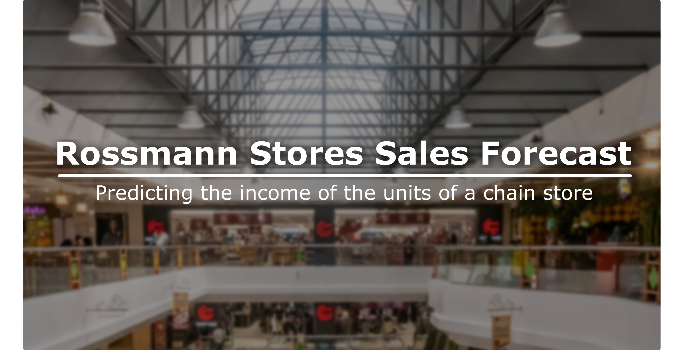
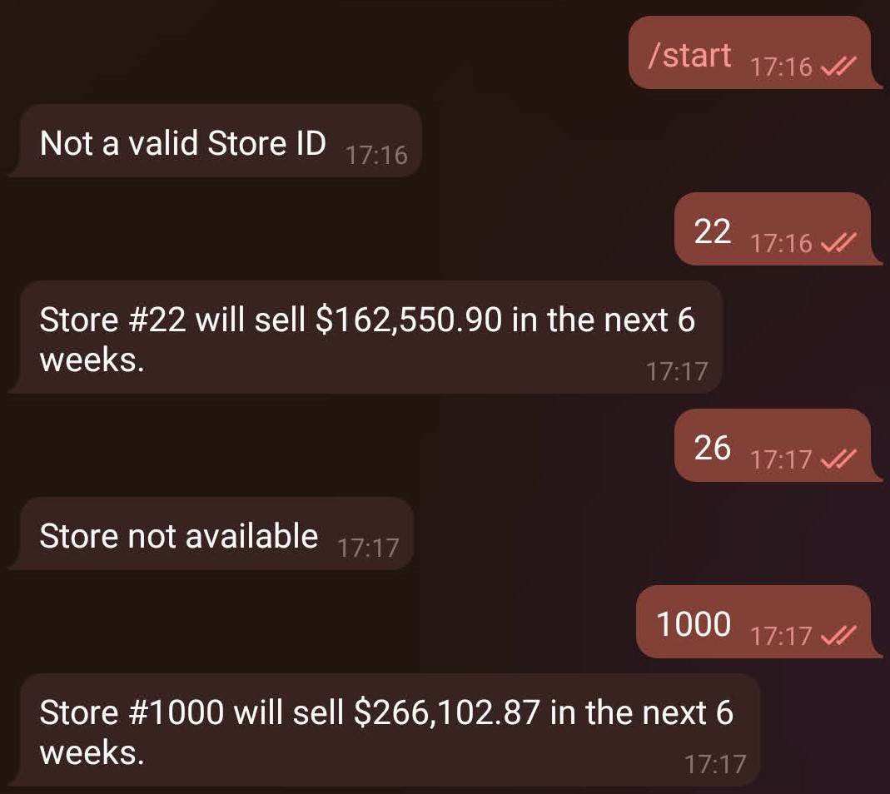

# Rossmann Stores Sales Forecast

## Predicting the income of the units of a chain store

## Business Problem

Rossmann is one of the largest chains of drug stores in Europe, with [+4k stores as of 2019](https://www.retail-index.com/sectors/personalcareretailersineurope.aspx). Its business model is that of a common pharmacy, but with several standardized units spread throughout the continent.

The manager of each store came up with the task of predicting the daily sales of their units for up to 6 weeks in advance. This task was assigned to the Data Science team of the whole chain, who must model the historical database in order to generate the desired forecasting. 

The [database](https://www.kaggle.com/c/rossmann-store-sales) spans around 2.5 years in time (between 2013 and 2015) and 1115 stores in total, containing information for each unit describing factors such as promotions, competition, school and state holidays and seasonality.

## Business Assumptions

- The whole analysis is understood to be done on the week after the last record in the database.

## Solution Strategy

In order to solve this challenge, the work went along the following steps:
1. **Data Description:** understanding of the status of the database and dealing with missing values properly. Basic statistics metrics furnish an overview of the data.  
2. **Feature Engineering:** derivation of new attributes based on the original variables aiming to better describe the phenomenon that will be modeled, and to supply interesting attributes for the Exploratory Data Analysis.
3. **Data Filtering:** filtering of records and selection of attributes that do not contain information for modeling or that do not match the scope of the business problem.
4. **Exploratory Data Analysis (EDA):** exploration of the data searching for insights and seeking to understand the impact of each variable on the upcoming machine learning modeling.
5. **Data Preparation:** preprocessing stage required prior to the machine learning modeling step.
6. **Feature Selection:** selection of the most significant attributes for training the model.
7. **Machine Learning Modeling:** implementation of a few algorithms appropriate to the task at hand. In this case, models befitting the *regression* assignment - *i.e.*, forecasting a continuous value, namely sales.
8. **Hyperparameter Fine Tuning:** search for the best values for each of the parameters of the best performing model(s) selected from the previous step.
9. **Translation and Interpretation of the Model Performance:** conversion of the performance metrics of the Machine Learning model to a more tangible business result.
10. **Deployment of Model to Production:** publication of the model in a cloud environment so that the interested people can access its results to improve business decisions.

Moreover, the workflow followed the [CRISP-DM](https://www.datascience-pm.com/crisp-dm-2/) methodology, aiming to work in the problem through successively deeper cycles, while delivering value early, since the first run. 

## Top 3 Insights From Exploratory Data Analysis

- **Hypothesis 1:** stores with greater assortment have a bigger income.  
   ***True:*** among the 3 possible assortments for each unit, those in the 'extra' category sell more in average than those in 'extended', which, by its turn, sell more in average than those in 'basic'.

- **Hypothesis 2:** stores that extend promotions have a bigger income.  
   ***False:*** in average, stores that joined the continuing consecutive promotion performed worse than before.

- **Hypothesis 3:** stores perform better in terms of sales after the 10th day of each month.  
   ***False:*** the average performance is better for the first 10 days of the month.

## Machine Learning Modeling Performance

The final chosen algorithm was the XGBoost Regressor, which presented the following performance after the appropriate hyperparameter fine tuning, on K-fold cross-validation with 5 splits:  

| Model Name | Mean Absolute Error | Mean Absolute Percentage Error | Root Mean Squared Error |
| ---- | :----: | :----: | :----: |
| XGBoost Regressor (tuned HP) | 817.73 &pm; 115.51 | 0.12 &pm; 0.01 | 1183.78 &pm; 168.70 |

For completeness, we also include the performances of the remaining employed algorithms ("HP" stands for "hyperparameters"):

| Model Name | Mean Absolute Error | Mean Absolute Percentage Error | Root Mean Squared Error |
| ---- | :----: | :----: | :----: |
| Random Forest Regressor (tuned HP) | 857.67 &pm; 243.49 | 0.12 &pm; 0.03| 1269.48 &pm; 351.13 |
| Random Forest Regressor|	861.30 &pm; 246.09	| 0.12 &pm; 0.03 | 1274.63 &pm; 354.57 |
| XGBoost Regressor	| 1035.44 &pm; 194.91	| 0.14 &pm; 0.02 | 1488.23 &pm; 266.80 |
| Average Model | 1610.93 &pm; 423.44	| 0.22 &pm; 0.03 | 2148.18 &pm; 557.91 |
| Simple Linear Regression | 2098.69 &pm; 323.81 | 0.30 &pm; 0.02 | 2989.41 &pm; 505.97 |
| Lasso Linear Regression |	2129.78 &pm; 369.49 | 0.30 &pm; 0.01 | 3069.62 &pm; 550.58 |

## Business Results	

**Day-wise**, the predictions generated by the final model exhibited mean absolute errors

> *smaller than 15%* for *97.04%* of the stores, 

and 

> *smaller than 10%* for *67.53%* of them.

As for the initial request of the managers, in the total of the **last 6 weeks of records** in the database (test subset), the total error of the predictions was
> ***smaller than 10%*** for ***97.58%*** of the stores,

and

> ***smaller than 5%*** for ***75.7%*** of them.

In the overall of the stores, the ***actual income of $289,571,750.00*** for the 6 weeks was ***predicted to be $286,722,368.00***, what corresponds to a subestimation of ***0.98%***.

## Conclusions

The final model performed satisfactorily enough to be deployed to production. Notice that the deployment scripts are included in the last section of the notebook file, but were employed as in the standalone folders (see inside 'deployment'), which were pushed to a cloud storage (in this case, Heroku).

The predictions can be conveniently accessed through a Telegram bot just by messaging the number of desired store (that is, between 1 and 1115), one at a time, as in the following preview.

Notice that some of them are not available in the production dataset. Also, the bot might be idle most of the time, so be patient on your request (it should not take more than 1 minute to have a response).

### Accessing the bot

It is very straightforward, just look for @rossmann_sales_forecast_bot on Telegram or click the button below:

## *Note on visualization*

A better reading of the main notebook might be achieved by enabling the following [Jupyter Notebook Extensions](https://github.com/ipython-contrib/jupyter_contrib_nbextensions):
- Collapsible Headings;
- Hide input;
- Split Cells Notebook.
